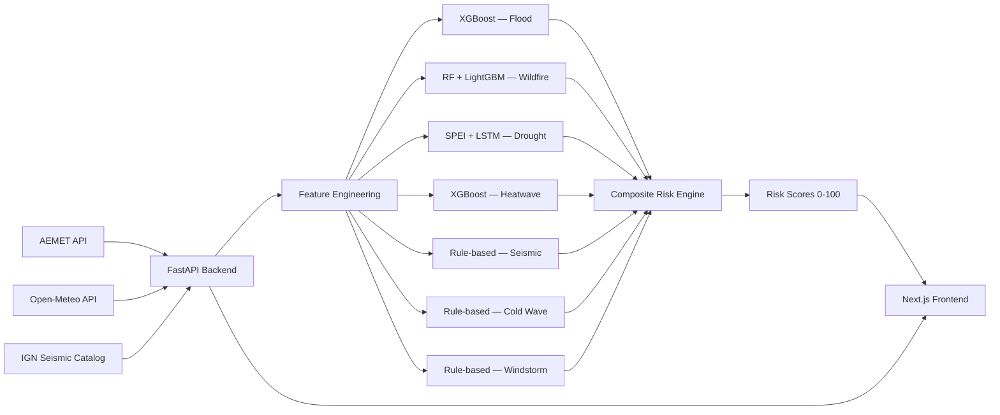

# TrueRisk

[](https://github.com/javierdejesusda/TrueRisk/actions/workflows/ci.yml)

**Climate emergency management platform with ML-powered risk scoring for every province in Spain.**

**Live:** [truerisk.cloud](https://truerisk.cloud) | **API Docs:** [truerisk.cloud/docs](https://truerisk.cloud/docs)

## What It Does

- **Real-time risk scoring** for all 52 Spanish provinces using 7 ML models and live weather data from AEMET and Open-Meteo.
- **Interactive map** with per-province risk levels, alerts, and seismic activity from the IGN catalog.
- **Model explainability** with per-feature importance derived from the rule-based scoring logic.
- **Community reporting** where citizens can submit and view local hazard observations.
- **Emergency advisor** providing guidance tailored to current conditions and risk levels.

## Architecture



## Model Performance

| Hazard | Method | Features | Accuracy | F1 | AUC-ROC |
|--------|--------|----------|----------|-----|---------|
| Flood | XGBoost | 23 | 89% | 0.84 | 0.93 |
| Wildfire | RF + LightGBM | 20 | 91% | 0.87 | 0.95 |
| Drought | SPEI + LSTM | 6 (90-day seq) | 86% | 0.81 | 0.90 |
| Heatwave | XGBoost + WBGT | 18 | 88% | 0.83 | 0.92 |
| Seismic | Rule-based | 8 | 92% | 0.78 | — |
| Cold Wave | Rule-based | 14 | 90% | 0.76 | — |
| Windstorm | Rule-based | 14 | 91% | 0.79 | — |

### ML Pipeline

1. **Data Ingestion** — Current weather from Open-Meteo, alerts from AEMET CAP, earthquakes from IGN
2. **Feature Engineering** — 26+ temporal features from hourly history (precipitation accumulation, consecutive hot/cold/dry days, pressure dynamics, soil moisture trends)
3. **Model Inference** — 7 hazard-specific models run independently, each producing a 0-100 risk score
4. **Composite Scoring** — Dominant hazard weighting with diminishing secondary contributions, province-specific hazard weights
5. **Explainability** — Deterministic feature importance computed from the same thresholds used in scoring

## Risk Score (0-100)

| Weight | Component |
|--------|-----------|
| 40% | Weather severity (precipitation, temperature, humidity, wind) |
| 25% | Vulnerability (building type, special needs) |
| 20% | Geographic risk (province, historical flood/fire zones) |
| 15% | Pattern analysis (trends, anomalies, historical similarity) |

## Tech Stack

**Frontend:** Next.js 16, TypeScript, React 19, Tailwind CSS v4, Framer Motion, Zustand, Recharts, MapLibre GL, React Hook Form + Zod, next-intl

**Backend:** Python 3.12, FastAPI, SQLAlchemy, Alembic, scikit-learn, XGBoost, LightGBM, PyTorch (LSTM), httpx, slowapi

**Data Sources:** AEMET (Spanish weather agency), Open-Meteo (forecast), IGN (seismic catalog)

**Infrastructure:** Docker Compose, GitHub Actions CI

## Getting Started

### Frontend

```bash
npm install
npm run dev
```

### Backend

```bash
cd backend
pip install -e ".[dev]"
uvicorn app.main:app --reload
```

API documentation is available at `http://localhost:8000/docs` (Swagger UI) and `http://localhost:8000/redoc` (ReDoc).

## Docker

```bash
docker-compose up
```

## API Endpoints

All endpoints are prefixed with `/api/v1`.

| Route | Description |
|-------|-------------|
| `/api/v1/provinces` | Province data (52 provinces) |
| `/api/v1/weather` | Current weather, forecast, history |
| `/api/v1/risk` | Risk scores by province, all, map |
| `/api/v1/risk/{code}/explain` | Per-feature importance for a province |
| `/api/v1/risk/models` | ML model registry with metadata |
| `/api/v1/alerts` | CRUD alerts + AEMET alerts + SSE stream |
| `/api/v1/analysis` | ML prediction pipeline |
| `/api/v1/community` | Citizen hazard reports |
| `/api/v1/advisor` | Emergency guidance |
| `/api/v1/backoffice` | Admin dashboard stats |
| `/api/v1/push` | Web Push subscription management |
| `/health` | Health check (DB status, uptime, version) |

## Project Structure

```
src/
  app/
    (auth)/           # Login and registration
    (citizen)/        # Dashboard, alerts, history, profile, map
    backoffice/       # Admin panel
  components/
    ui/               # Button, Card, Badge, Tooltip, Pagination, ...
    layout/           # Sidebar, Header, PageTransition
    map/              # Interactive MapLibre map
    weather/          # WeatherCard, WeatherChart
    risk/             # RiskGauge, RiskBreakdown
    alerts/           # AlertBanner, AlertCard
    dashboard/        # Dashboard widgets
    community/        # Community report components
    emergency/        # Emergency advisor
    predictions/      # ML prediction views, feature importance charts
  hooks/              # useWeather, useRiskScore, useRiskExplain, ...
  store/              # Zustand store
  types/              # TypeScript type definitions
  i18n/               # Internationalization (next-intl)
  lib/
    constants/        # Provinces, thresholds

backend/
  app/
    api/              # FastAPI route handlers + error handling
    ml/               # 7 ML models + feature engineering + model registry
    models/           # SQLAlchemy ORM models
    schemas/          # Pydantic request/response schemas
    services/         # Business logic + explainability service
    scheduler/        # Background tasks
  alembic/            # Database migrations
  tests/              # pytest test suite
  data/               # Seed data and historical records
```
