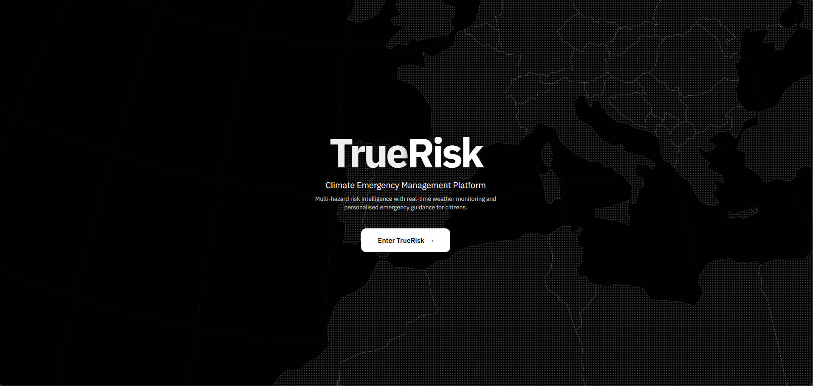
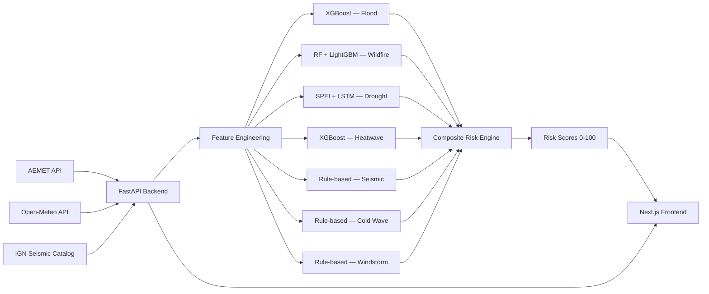

<div align="center">



[](https://github.com/javierdejesusda/TrueRisk/actions/workflows/ci.yml)
[](LICENSE)
[](https://python.org)
[](https://nodejs.org)

**Multi-hazard risk intelligence platform with real-time weather monitoring, ML-powered risk scoring, and personalized emergency guidance for every province in Spain.**

[Live Platform](https://truerisk.cloud) · [API Docs](https://truerisk.cloud/docs) · [Technical Report](docs/technical-report/main.pdf)

</div>

---

## Features

- **7 ML risk models** — Flood, wildfire, drought, heatwave, seismic, cold wave, and windstorm risk scored 0–100 for all 52 Spanish provinces
- **Real-time weather monitoring** — Live data from AEMET (Spanish Weather Agency), Open-Meteo forecasts, and IGN seismic catalog
- **Interactive risk map** — Province-level risk visualization with MapLibre GL, alert overlays, and seismic activity markers
- **AI emergency advisor** — Context-aware safety guidance powered by OpenAI, tailored to current conditions and location
- **Community hazard reports** — Citizens can submit and view local hazard observations with photo evidence
- **Model explainability** — Per-feature importance breakdown showing why each risk score was computed
- **Temporal Fusion Transformer forecasting** — Deep learning sequence models for multi-day risk prediction
- **Multi-channel alerts** — Web Push notifications, email (Resend), SMS (Twilio), and Telegram bot integration
- **Drought dashboard** — Dedicated monitoring with SPEI index, reservoir levels, and LSTM-based predictions
- **Property risk assessment** — Location-specific risk analysis for real estate and insurance applications
- **Emergency preparedness** — Personalized emergency plans, evacuation routes, and safety guidelines
- **Admin backoffice** — Alert management, data records, and system monitoring dashboard
- **Bilingual** — Full English and Spanish support via next-intl
- **Authentication** — NextAuth v5 with JWT, Google OAuth, and GitHub OAuth

## Architecture



## Model Performance

| Hazard | Method | Features | Accuracy | F1 | AUC-ROC |
|--------|--------|----------|----------|-----|---------|
| Flood | XGBoost | 23 | 89% | 0.84 | 0.93 |
| Wildfire | RF + LightGBM | 20 | 91% | 0.87 | 0.95 |
| Drought | SPEI + LSTM | 6 (90-day seq) | 86% | 0.81 | 0.90 |
| Heatwave | XGBoost + WBGT | 18 | 88% | 0.83 | 0.92 |
| Seismic | Rule-based | 8 | 92% | 0.78 | — |
| Cold Wave | Rule-based | 14 | 90% | 0.76 | — |
| Windstorm | Rule-based | 14 | 91% | 0.79 | — |

### ML Pipeline

1. **Data Ingestion** — Current weather from Open-Meteo, alerts from AEMET CAP, earthquakes from IGN
2. **Feature Engineering** — 26+ temporal features from hourly history (precipitation accumulation, consecutive hot/cold/dry days, pressure dynamics, soil moisture trends)
3. **Model Inference** — 7 hazard-specific models run independently, each producing a 0-100 risk score
4. **Composite Scoring** — Dominant hazard weighting with diminishing secondary contributions, province-specific hazard weights
5. **Explainability** — Deterministic feature importance computed from the same thresholds used in scoring

### Risk Score (0–100)

| Weight | Component |
|--------|-----------|
| 40% | Weather severity (precipitation, temperature, humidity, wind) |
| 25% | Vulnerability (building type, special needs) |
| 20% | Geographic risk (province, historical flood/fire zones) |
| 15% | Pattern analysis (trends, anomalies, historical similarity) |

## Tech Stack

### Frontend

| Technology | Version |
|-----------|---------|
| [Next.js](https://nextjs.org) | 16 |
| [React](https://react.dev) | 19 |
| [TypeScript](https://typescriptlang.org) | 5 |
| [Tailwind CSS](https://tailwindcss.com) | 4 |
| [Framer Motion](https://motion.dev) | 12 |
| [MapLibre GL](https://maplibre.org) | 5 |
| [Recharts](https://recharts.org) | 3 |
| [Zustand](https://zustand.docs.pmnd.rs) | 5 |
| [next-intl](https://next-intl.dev) | 4 |
| [NextAuth](https://authjs.dev) | 5 (beta) |
| [React Hook Form](https://react-hook-form.com) + [Zod](https://zod.dev) | 7 / 4 |

### Backend

| Technology | Version |
|-----------|---------|
| [Python](https://python.org) | 3.12 |
| [FastAPI](https://fastapi.tiangolo.com) | 0.115+ |
| [SQLAlchemy](https://sqlalchemy.org) | 2.0+ (async) |
| [Alembic](https://alembic.sqlalchemy.org) | 1.14+ |
| [XGBoost](https://xgboost.readthedocs.io) | 2.1+ |
| [LightGBM](https://lightgbm.readthedocs.io) | 4.5+ |
| [PyTorch](https://pytorch.org) | 2.4+ |
| [PyTorch Forecasting](https://pytorch-forecasting.readthedocs.io) | 1.1+ (TFT) |
| [Torch Geometric](https://pyg.org) | 2.6+ (GNN) |
| [scikit-learn](https://scikit-learn.org) | 1.5+ |
| [SHAP](https://shap.readthedocs.io) | 0.45+ |

### Infrastructure

| Technology | Purpose |
|-----------|---------|
| PostgreSQL 16 | Production database |
| Docker Compose | Container orchestration |
| GitHub Actions | CI/CD pipeline |
| Sentry | Error tracking and monitoring |

### Data Sources

| Source | Data |
|--------|------|
| [AEMET](https://opendata.aemet.es) | Real-time weather, CAP alerts |
| [Open-Meteo](https://open-meteo.com) | Forecast and historical weather |
| [IGN](https://www.ign.es) | Seismic catalog |

## Prerequisites

- **Node.js** 22+
- **Python** 3.12+
- **PostgreSQL** 16+ (or use Docker)
- **API keys:** [AEMET OpenData](https://opendata.aemet.es/centrodedescargas/inicio) (free, required for weather data)

## Getting Started

### 1. Clone and install

```bash
git clone https://github.com/javierdejesusda/TrueRisk.git
cd TrueRisk

# Frontend
npm install

# Backend
cd backend
pip install -e ".[dev]"
```

### 2. Configure environment

```bash
# Frontend — copy and fill in your API keys
cp .env.example .env

# Backend — copy and fill in your API keys
cp backend/.env.example backend/.env
```

See `.env.example` and `.env.production.example` for all available configuration options.

### 3. Set up the database

```bash
cd backend

# Run migrations (uses DATABASE_URL from .env, defaults to SQLite for development)
alembic upgrade head
```

### 4. Start development servers

```bash
# Frontend (from project root)
npm run dev

# Backend (from backend/)
cd backend
uvicorn app.main:app --reload
```

- Frontend: [http://localhost:3000](http://localhost:3000)
- Backend API: [http://localhost:8000/docs](http://localhost:8000/docs) (Swagger UI)
- ReDoc: [http://localhost:8000/redoc](http://localhost:8000/redoc)

### Docker

```bash
# Development (frontend + backend + PostgreSQL)
docker compose up

# Production
docker compose -f docker-compose.prod.yml up
```

## Testing

```bash
# Frontend — unit and integration tests
npm test

# Frontend — with coverage
npx vitest run --coverage

# Frontend — type checking
npx tsc --noEmit

# Frontend — linting
npx eslint .

# Backend — test suite
cd backend && pytest

# Backend — with coverage
cd backend && pytest --cov=app --cov-report=term-missing

# Backend — type checking
cd backend && mypy app

# Backend — linting
cd backend && ruff check .
```

## API Endpoints

All endpoints are prefixed with `/api/v1`.

| Route | Description |
|-------|-------------|
| `/api/v1/provinces` | Province data (52 provinces) |
| `/api/v1/weather` | Current weather, forecast, history |
| `/api/v1/risk` | Risk scores by province, all, map view |
| `/api/v1/risk/{code}/explain` | Per-feature importance for a province |
| `/api/v1/risk/models` | ML model registry with metadata |
| `/api/v1/alerts` | CRUD alerts + AEMET alerts + SSE stream |
| `/api/v1/analysis` | ML prediction pipeline |
| `/api/v1/community` | Citizen hazard reports |
| `/api/v1/advisor` | Emergency guidance |
| `/api/v1/chat` | AI-powered conversation |
| `/api/v1/drought` | Drought monitoring data |
| `/api/v1/property` | Property risk assessment |
| `/api/v1/push` | Web Push subscription management |
| `/api/v1/backoffice` | Admin dashboard stats |
| `/health` | Health check |
| `/ready` | Readiness check (DB, models) |

## Project Structure

```
├── src/
│   ├── app/
│   │   ├── (auth)/           # Login, registration, password reset
│   │   ├── (citizen)/        # Dashboard, map, alerts, chat, predictions, reports
│   │   ├── (legal)/          # Privacy, terms, cookies, accessibility
│   │   ├── backoffice/       # Admin panel
│   │   └── api/              # Server-side API routes
│   ├── components/           # 140+ React components
│   ├── hooks/                # 50+ custom hooks
│   ├── store/                # Zustand state management
│   ├── types/                # TypeScript type definitions
│   ├── i18n/                 # Internationalization config
│   └── lib/                  # Utilities and constants
├── backend/
│   ├── app/
│   │   ├── api/              # 30+ FastAPI route handlers
│   │   ├── ml/
│   │   │   ├── models/       # 7 hazard models + TFT + GNN
│   │   │   ├── features/     # Feature engineering
│   │   │   └── training/     # Training scripts
│   │   ├── models/           # SQLAlchemy ORM models
│   │   ├── schemas/          # Pydantic request/response schemas
│   │   ├── services/         # Business logic + explainability
│   │   ├── scheduler/        # Background tasks
│   │   └── security/         # Auth and encryption
│   ├── alembic/              # Database migrations
│   └── tests/                # pytest test suite
├── messages/                 # i18n translations (en, es)
├── docs/
│   └── technical-report/     # Academic paper (PDF)
└── docker-compose.yml        # Docker development environment
```

## Contributing

Contributions are welcome. Please read [CONTRIBUTING.md](CONTRIBUTING.md) for guidelines.

## Security

To report security vulnerabilities, please see [SECURITY.md](SECURITY.md).

## License

[MIT](LICENSE) — Copyright (c) 2026 Javier de Jesus
